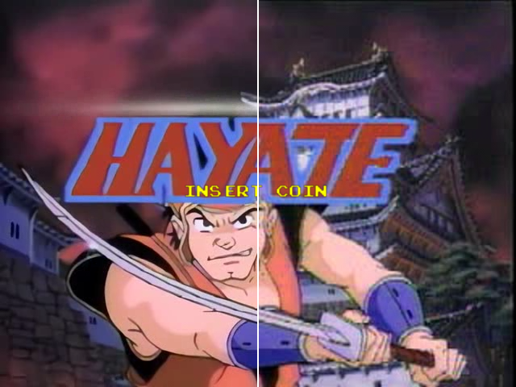

# Hypseus Singe

## Singe 1 replacement files

Singe 1 files within the ``00-singe1`` folder contain alignment changes and fixes to original games:

- *singeWantsCrosshairs()* function check added to Singe 1 gun games.
- Last Bounty Hunter (*lbh*) now has a **fix** that shows Handsome Harry as captured.....  
- Maddog McCree (*maddog*) has **fix** for nil value error loop in doLevelPond()
- Space Pirates (*spacepirates*) has a **fix** for nil value index error.
- Mad Dog II: Typing Edition (*typing-md2*) has SDL2 keycode porting changes.
- Ninja Hayate: Death loop bug **fix** in bytecode (_v1.15_) - game now completable.

Fan games have some other changes for alignment and completeness.

These updates are advised for best experience. Pull requests accepted for any fixes or improvements ``:)``

### Timegal

For an increased resolution `timegal` use the video from: https://youtu.be/LmHvRNQPz4E

    ffmpeg -i TimeGal.mp4 -an -qscale:v 4 -b:v 6000k -vf tpad=stop_mode=clone:stop_duration=1,fps=29.970 -codec:v mpeg2video timegal.m2v

Replace existing `timegal.m2v` with the new video and use `.singe` _LUA_, from the `timegal` folder, in this repository.

### Hayate

For an AI cleanup of `hayate` use the video from: https://youtu.be/7k5KMbzxX0o

     ffmpeg -i hayate1.mp4 -an -qscale:v 4 -b:v 6000k -vf scale=640:480 -codec:v mpeg2video hayate.m2v

     ffmpeg -i hayate1.mp4 -an -qscale:v 4 -b:v 6000k -vf scale=960:720 -codec:v mpeg2video hayate.m2v

Replace existing `hayate.m2v` with the new video and use `.singe` _LUA_, from the `hayate` folder, in this repository.

